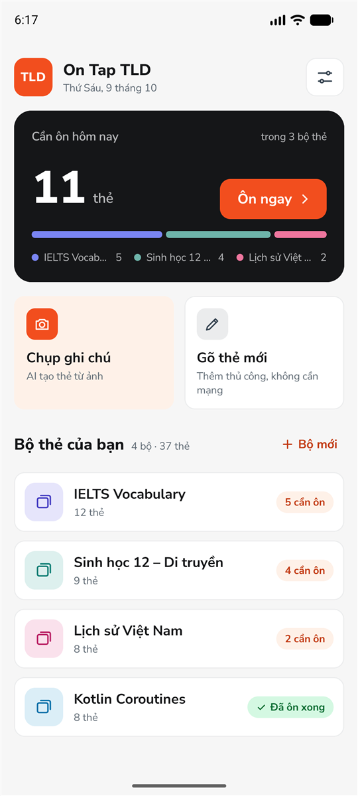
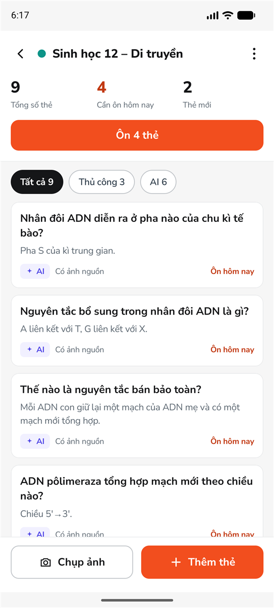
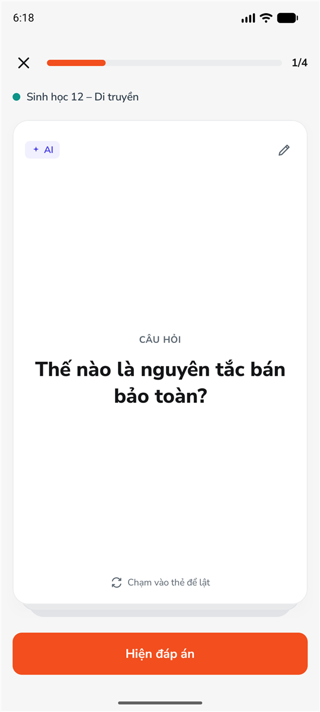
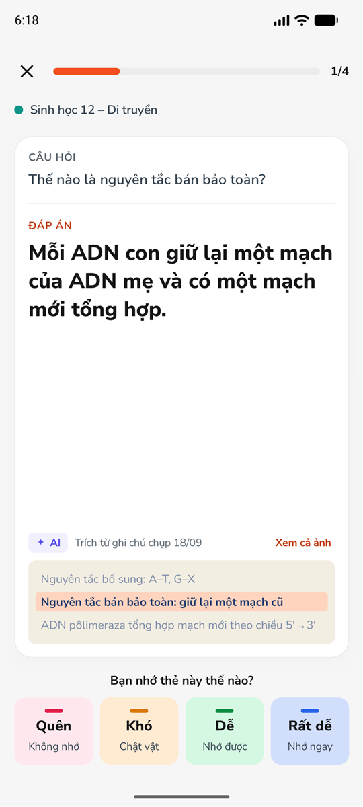
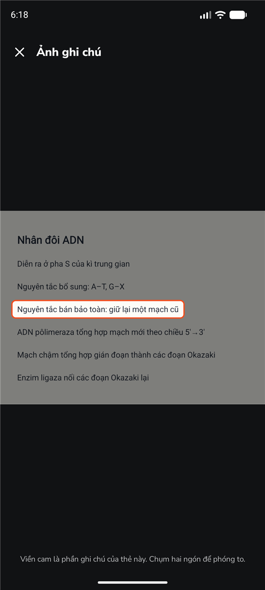
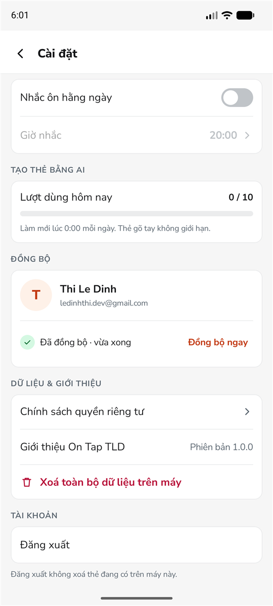

# On Tap TLD

App flashcard cho Android: **chụp trang ghi chú, AI gợi ý thẻ ôn tập, rồi ôn theo lịch lặp lại
ngắt quãng (SM-2)**. Viết bằng Kotlin và Jetpack Compose, theo Clean Architecture + MVVM.

App chạy được ngay không cần tài khoản và không cần mạng: mọi thứ lưu trên máy. Mạng chỉ cần cho
hai việc tuỳ chọn — nhờ AI soạn thẻ, và đồng bộ lên đám mây sau khi đăng nhập Google.

**▶ Video demo:** https://www.youtube.com/watch?v=6vQqLnVYt8c

---

## Giao diện

<table>
  <tr>
    <td></td>
    <td></td>
    <td></td>
  </tr>
  <tr>
    <td align="center">Home</td>
    <td align="center">Chi tiết bộ thẻ</td>
    <td align="center">Ôn tập — câu hỏi</td>
  </tr>
  <tr>
    <td></td>
    <td></td>
    <td></td>
  </tr>
  <tr>
    <td align="center">Ôn tập — đáp án</td>
    <td align="center">Ảnh nguồn của thẻ AI</td>
    <td align="center">Tài khoản và đồng bộ</td>
  </tr>
</table>

---

## Tính năng

**Tạo thẻ**
- Chụp ghi chú bằng camera (CameraX) hoặc chọn ảnh từ thư viện, kéo bốn góc để cắt vùng chữ.
- Nhận dạng chữ ngay trên máy bằng ML Kit, không cần mạng; sửa được văn bản trước khi gửi cho AI.
- Gemini (qua Firebase AI Logic) đề xuất tối đa 10 thẻ. Người dùng duyệt lại — bỏ, sửa, thêm — rồi
  mới lưu. Mỗi máy được 10 lượt AI một ngày; lượt chỉ bị trừ khi AI thật sự trả về thẻ.
- Gõ thẻ thủ công, lưu xong ở lại màn để nhập liền nhiều thẻ.

**Ôn tập**
- Lịch ôn theo thuật toán SM-2 với bốn mức chấm: Quên, Khó, Dễ, Rất dễ.
- Thẻ lật bằng hoạt ảnh; mặt đáp án của thẻ AI trích lại đúng dòng ghi chú mà thẻ được rút ra, và
  mở được ảnh gốc với vùng đó được tô sáng (chụm hai ngón để phóng to).
- Cuối phiên: lịch ôn sắp tới, và ôn lại ngay các thẻ vừa quên.
- Thông báo nhắc ôn hằng ngày vào giờ tự chọn, chỉ gửi khi còn thẻ đến hạn.

**Quản lý**
- Bộ thẻ có màu nhận diện; lọc thẻ theo nguồn (thủ công / AI); vuốt để sửa hoặc xoá.
- Xoá bộ thẻ hay xoá thẻ thì ghi chú và file ảnh không còn dùng cũng được dọn theo.

**Tài khoản và đồng bộ** (tuỳ chọn)
- Đăng nhập Google bằng Credential Manager + Firebase Auth.
- Đồng bộ hai chiều với Cloud Firestore: bộ thẻ, thẻ, tiến độ ôn và phần chữ của ghi chú. Ảnh
  ghi chú luôn ở lại trên máy.

**Giao diện**
- Sáng / tối / theo máy; tiếng Việt và tiếng Anh, đổi ngay trong app.
- Mọi màn danh sách có đủ trạng thái đang tải, rỗng và lỗi.

---

## Công nghệ

| Phần | Dùng gì |
| --- | --- |
| Ngôn ngữ, giao diện | Kotlin 2.2, Jetpack Compose (Material 3), Navigation Compose (route kiểu an toàn) |
| Kiến trúc | Clean Architecture + MVVM, luồng dữ liệu một chiều bằng `StateFlow` |
| Dependency injection | Hilt |
| Lưu trên máy | Room (schema v3, có migration và test migration), DataStore |
| Việc nền | WorkManager — nhắc ôn hằng ngày, đồng bộ khi có mạng |
| Camera và nhận dạng chữ | CameraX, ML Kit Text Recognition (mô hình gói kèm app) |
| AI | Gemini qua Firebase AI Logic, bảo vệ bằng Firebase App Check |
| Tài khoản và đám mây | Credential Manager, Firebase Auth, Cloud Firestore |
| Test | JUnit 4, MockK, Turbine, kotlinx-coroutines-test, Room testing |

`minSdk` 24 (Android 7.0), `targetSdk` 36.

---

## Kiến trúc

Mỗi tính năng là một thư mục trong `feature/`, tự có đủ ba lớp. Lớp trong không biết gì về lớp
ngoài: `domain` là Kotlin thuần nên test được mà không cần Android.

```
presentation   Compose Screen  ──sự kiện──▶  ViewModel  ──StateFlow──▶  Screen vẽ lại
     │
     ▼ gọi
domain         UseCase (một hành động nghiệp vụ)  ·  model  ·  interface Repository
     ▲
     │ hiện thực
data           RepositoryImpl  ·  Room DAO  ·  Firestore  ·  ML Kit  ·  Gemini
```

```
app/src/main/java/com/ledinhthi/ontaptld/
├── core/         nền dùng chung: BaseViewModel, điều hướng, theme, component, Room, xử lý lỗi,
│                 gọi AI, hàng đợi đồng bộ
├── feature/
│   ├── deck/     bộ thẻ, thẻ, ghi chú
│   ├── review/   ôn tập, SM-2, xem ảnh nguồn
│   ├── capture/  chụp ảnh → nhận dạng chữ → AI đề xuất thẻ
│   ├── auth/     đăng nhập Google
│   ├── sync/     đồng bộ với Firestore
│   ├── reminder/ thông báo nhắc ôn
│   └── settings/ cài đặt, ngôn ngữ
└── navigation/   danh sách route và NavHost
```

### Vài điểm đáng xem trong code

- **SM-2 là một hàm thuần** ([`Sm2Calculator`](app/src/main/java/com/ledinhthi/ontaptld/feature/review/domain/Sm2Calculator.kt)),
  không phụ thuộc Android, có bộ test riêng.
- **AI không cần API key trong app.** Yêu cầu đi qua Firebase AI Logic và được App Check xác nhận
  đến từ đúng app này. AI bị buộc trả JSON theo khuôn, và lời dặn cho AI yêu cầu bỏ qua mọi "mệnh
  lệnh" nằm lẫn trong ghi chú của người dùng
  ([`FlashcardPrompt`](app/src/main/java/com/ledinhthi/ontaptld/core/data/ai/FlashcardPrompt.kt)).
- **Đồng bộ offline-first.** Mỗi thay đổi trên máy để lại một lệnh trong bảng `sync_queue`; một
  lượt đồng bộ kéo thay đổi từ đám mây về rồi mới đẩy hàng đợi lên. Hai máy cùng sửa một thẻ thì
  bản sửa sau thắng (Last-Write-Wins theo `updatedAt`). Mốc "đã kéo tới đâu" dùng giờ của máy
  chủ, để thay đổi của một máy mất mạng lâu vẫn được máy khác kéo về
  ([`SyncRepositoryImpl`](app/src/main/java/com/ledinhthi/ontaptld/feature/sync/data/SyncRepositoryImpl.kt),
  [`SyncDao`](app/src/main/java/com/ledinhthi/ontaptld/core/sync/SyncDao.kt)).
- **Sống sót khi bị hệ thống tắt dưới nền.** Văn bản đang sửa và danh sách thẻ AI đang duyệt được
  cất vào `SavedStateHandle`; mở lại app không phải nhận dạng lại hay gọi AI lần nữa.
- **ViewModel không cầm `NavController` hay `Context`.** Điều hướng, hộp thoại và thông báo ngắn đi
  qua `AppNavigator`; chuỗi hiển thị lấy qua `StringProvider` — nên ViewModel test được bằng
  JUnit thường.
- **Repo clone về vẫn build được dù không có Firebase.** `google-services.json` không được commit;
  thiếu file thì plugin không được áp dụng và app tự bỏ qua các phần cần Firebase.

Muốn đọc sâu hơn: [hướng dẫn cho dev mới](docs/HUONG_DAN_DEV_MOI.md) đi theo một luồng thật từ lúc
bấm nút tới lúc ghi vào database.

---

## Chạy dự án

Cần Android Studio bản gần đây (đã kèm JDK 17) và một emulator hoặc máy thật Android 7.0 trở lên.

```bash
git clone https://github.com/Thi1503/on-tap-tld.git
```

Mở thư mục bằng Android Studio, chờ Gradle sync xong rồi bấm **Run**. Hoặc cài từ dòng lệnh:

```bash
./gradlew :app:installDebug
```

Không cấu hình gì thêm thì app vẫn chạy đủ phần offline: bộ thẻ, thẻ thủ công, ôn tập, nhắc ôn,
cài đặt. Ba phần sau cần Firebase.

### Bật AI, đăng nhập và đồng bộ

`app/google-services.json` không nằm trong repo, nên bạn cần một project Firebase của riêng mình:

1. Tạo project Firebase, thêm app Android với package `com.ledinhthi.ontaptld`, tải
   `google-services.json` về đặt vào thư mục `app/`.
2. **AI:** bật *AI Logic* với nhà cung cấp Gemini Developer API. Bật *App Check*; chạy bản debug
   một lần, lấy debug token trong Logcat (lọc `DebugAppCheckProvider`) rồi thêm vào App Check →
   Apps → Manage debug tokens.
3. **Đăng nhập:** bật *Authentication* → Google, và thêm SHA-1 của debug keystore
   (`./gradlew signingReport`) vào Project settings.
4. **Đồng bộ:** tạo *Cloud Firestore* và đặt Security Rules để mỗi người chỉ đọc / ghi phần của
   mình:

```
rules_version = '2';
service cloud.firestore {
  match /databases/{database}/documents {
    match /users/{userId} {
      allow read, create, update, delete: if request.auth != null
                                            && request.auth.uid == userId;

      match /{collection}/{docId} {
        allow read, write: if request.auth != null
                             && request.auth.uid == userId;
      }
    }
  }
}
```

### Dữ liệu mẫu

Để có sẵn 4 bộ thẻ, 37 thẻ (kèm một ghi chú AI có ảnh) cho việc xem thử — chỉ nạp được khi máy
chưa có bộ thẻ nào:

```bash
./gradlew :app:assembleDebug :app:assembleDebugAndroidTest
adb install -r app/build/outputs/apk/debug/app-debug.apk
adb install -r -t app/build/outputs/apk/androidTest/debug/app-debug-androidTest.apk
adb shell am instrument -w -e seedDemo true -e class com.ledinhthi.ontaptld.tools.DemoDataSeeder com.ledinhthi.ontaptld.test/androidx.test.runner.AndroidJUnitRunner
```

---

## Test

```bash
./gradlew :app:testDebugUnitTest
```

220 unit test chạy trên JVM, không cần emulator: thuật toán SM-2, use case, ViewModel của từng
màn, lời dặn cho AI, luật đồng bộ và bộ máy đồng bộ.

Test cần emulator (database Room thật): migration schema v1 → v3, SQL dọn ghi chú, xoá toàn bộ
dữ liệu, và SQL của hàng đợi đồng bộ.

```bash
./gradlew :app:connectedDebugAndroidTest
```

Lệnh trên gỡ app khỏi máy khi chạy xong. Cách chạy riêng một lớp test mà giữ nguyên app:
[kế hoạch phát triển, Mục 6.4](docs/KE_HOACH_PHAT_TRIEN.md).

---

## Giới hạn hiện tại

- Chưa có: widget màn hình chính, màn thống kê, onboarding, xoá tài khoản, trang chính sách quyền
  riêng tư.
- Đồng bộ không gồm ảnh ghi chú và lịch sử ôn; máy khác chỉ thấy thay đổi ở lần đồng bộ kế tiếp
  của nó (mở app, sửa thẻ hoặc bấm "Đồng bộ ngay"), không cập nhật tức thời.
- Giao diện mới được soát trên điện thoại màn dọc; chưa soát tablet, xoay ngang và cỡ chữ lớn.
- Chưa cấu hình ký phát hành: mới chạy bản debug.

---

## Tài liệu

- [Hướng dẫn cho dev mới](docs/HUONG_DAN_DEV_MOI.md) — đọc và sửa code theo đúng khuôn của dự án.
- [Kế hoạch phát triển](docs/KE_HOACH_PHAT_TRIEN.md) — tiến độ, quyết định đã chốt, những chỗ
  làm khác bản thiết kế và lý do.
- [Đặc tả nghiệp vụ](docs/docs_tld.md) và
  [tài liệu kiến trúc](docs/ANDROID_CLEAN_ARCHITECTURE_MVVM_BASE.md).

---

## Tác giả

Lê Đình Thi — [github.com/Thi1503](https://github.com/Thi1503)
